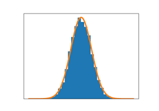

# 실습 8월 26일
# Table 작성
- 함수의 설명서는 아래와 같습니다.

| function   | Plot   | description    |
|------------|--------|----------------|
| ggbarstats | violin | for comparions |

# 소스코드 입력
- 터미널 bash 코드 입력 예제

```shell script
citation("ggstatsplot")
#> 
#>   Patil, I. (2018). ggstatsplot: 'ggplot2' Based Plots with Statistical
#>   Details. CRAN. Retrieved from
#>   https://cran.r-project.org/web/packages/ggstatsplot/index.html
#> 
#> A BibTeX entry for LaTeX users is
#> 
#>   @Article{,
#>     title = {{ggstatsplot}: 'ggplot2' Based Plots with Statistical Details},
#>     author = {Indrajeet Patil},
#>     year = {2018},
#>     journal = {CRAN},
#>     url = {https://CRAN.R-project.org/package=ggstatsplot},
#>     doi = {10.5281/zenodo.2074621},
#>   }
```

# 이미지

